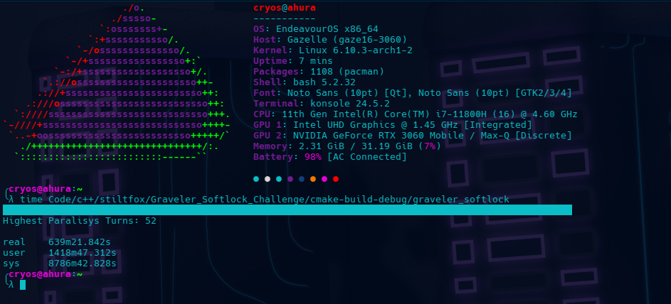

# Graveler Soft Lock YouTube Challenge
This program is based on the programming challenge set forth by [ShoddyCast](https://www.youtube.com/@ShoddyCast) on their
[video](https://www.youtube.com/watch?v=M8C8dHQE2Ro) where they analyze [Pikasprey's](https://www.youtube.com/@Pikasprey)
soft lock of Pokemon Fire Red, and Leaf Green. The soft lock video is [here](https://www.youtube.com/watch?v=GgMl4PrdQeo).

## The Challenge!
[ShoddyCast](https://www.youtube.com/@ShoddyCast) in their pursuit to demonstrate how hard it is to get out of the soft 
lock, wrote a python script to simulate 1 billion battles to see how many times Graveler would be paralyzed in battle. 
The goal was to see if in any of those 1 billion battles if we'd ever get 117 or more paralysis turns and escape the 
soft lock. [ShoddyCast's](https://www.youtube.com/@ShoddyCast) original python script took 8 days and some change to run, 
and he challenged the audience to make a similar program that would do the same 1 billion battles faster. This is my 
entry into that competition.

## My Time
I've tested this program many times. Due to the random nature of the battle simulations no run is going to give an exact
time to run. However, here's what I got on my latest test:

If you take the real time, which is how long it took in real life that's: 10 hours, 39 minutes and 21 seconds.

**Please note: the user and system times are different due to the threading taking up compute time for each individual thread
running. Real time is the actual time it took irl.

## How to compile!
For linux (my main OS), I just use [Clion](https://www.jetbrains.com/clion/) and [Cmake](https://cmake.org/) with 
[g++](https://gcc.gnu.org/) to compile. If your on Windows I would suggest using [visual studio](https://visualstudio.microsoft.com/)
(not Visual Studio Code, there is a difference).